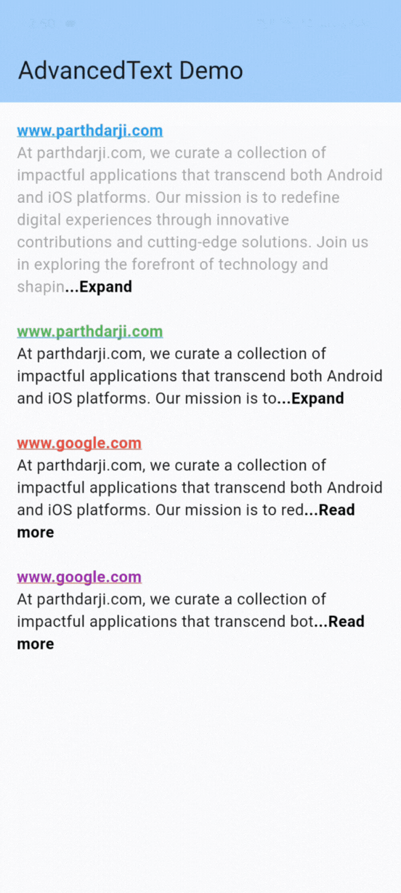

# Advanced Text

Advanced Text package lets you add the features like readmore/readless and clickable link to your Flutter app. It is also the most customizable text widget on whole pub market.



## Installation 

1. Add the latest version of package to your pubspec.yaml (and run`dart pub get`):
```yaml
dependencies:
  advanced_text: ^0.0.1
```
2. Import the package and use it in your Flutter App.
```dart
import 'package:advanced_text/advanced_text.dart';
```

## Example
There are a number of properties that you can modify:

 - text
 - textCustomization
    - style
    - textAlign
    - textDirection
    - textScaleFactor
    - locale
    - semanticsLabel
 - features
    - readMore
        - enable
        - decoration
        - onTap
        - trim
            - length
            - mode
        - expandedText
        - collapsedText
    - hyperlink
        - enable
        - style
        - onTap

```dart
class AdvancedTextExample extends StatelessWidget {
  const AdvancedTextExample({super.key});

  final String text =
      "At parthdarji.com, we curate a collection of impactful applications that transcend both Android and iOS platforms. Our mission is to redefine digital experiences through innovative contributions and cutting-edge solutions. Join us in exploring the forefront of technology and shaping the future of mobile applications.";

  @override
  Widget build(BuildContext context) {
    return Scaffold(
      appBar: AppBar(
        backgroundColor: Theme.of(context).colorScheme.inversePrimary,
        title: const Text("AdvancedText Demo"),
      ),
      body: Padding(
        padding: const EdgeInsets.all(15),
        child: Column(
          mainAxisAlignment: MainAxisAlignment.start,
          children: <Widget>[
            AdvancedText(
              "www.parthdarji.com\n$text",
              textCustomization: const TextCustomization(
                style: TextStyle(
                  color: Colors.grey,
                ),
              ),
              features: const AdvancedTextFeatures(
                hyperlink: Hyperlink(
                  enable: true,
                  style: TextStyle(
                    color: Colors.blue,
                    decoration: TextDecoration.underline,
                    fontWeight: FontWeight.bold,
                    decorationColor: Colors.blue,
                  ),
                ),
                readMore: ReadMore(
                  enable: true,
                  expandedText: "...Collapse",
                  collapsedText: "...Expand",
                  trim: AdvancedTrimmer(
                    length: 300,
                    mode: TrimMode.length,
                  ),
                ),
              ),
            ),
          ],
        ),
      ),
    );
  }
}
```